# Entity-Component-System Benchmarks

[](https://github.com/abeimler/ecs_benchmark/actions)


This repository contains a collection of benchmarks for popular Entity-Component-System (ECS) frameworks.
The benchmarks cover different aspects of ECS frameworks, such as update systems, component additions/removals, and entity creation/destruction.
It's important to note that different ECS frameworks have different strengths and weaknesses.
For example, some frameworks might excel in adding/removing components, while others might be better at creating/destroying entities or have query support.
Therefore, it's crucial to choose an ECS framework based on your specific requirements.

ECS (Entity-Component-System) Frameworks:

* [EntityX](https://github.com/alecthomas/entityx)
* [EnTT](https://github.com/skypjack/entt)
* [Ginseng](https://github.com/apples/ginseng)
* [mustache](https://github.com/kirillochnev/mustache)
* [flecs](https://github.com/SanderMertens/flecs)
* [pico_ecs](https://github.com/empyreanx/pico_headers)
* [gaia-ecs](https://github.com/richardbiely/gaia-ecs)

## TL;DR Results

Main feature of an ECS is the iterating over a lot of entities and using system to update the components.
The results of these benchmarks should be used as a starting point for your own benchmarking efforts.

### Update systems (for-each entities (with mixed components) in 7 systems)


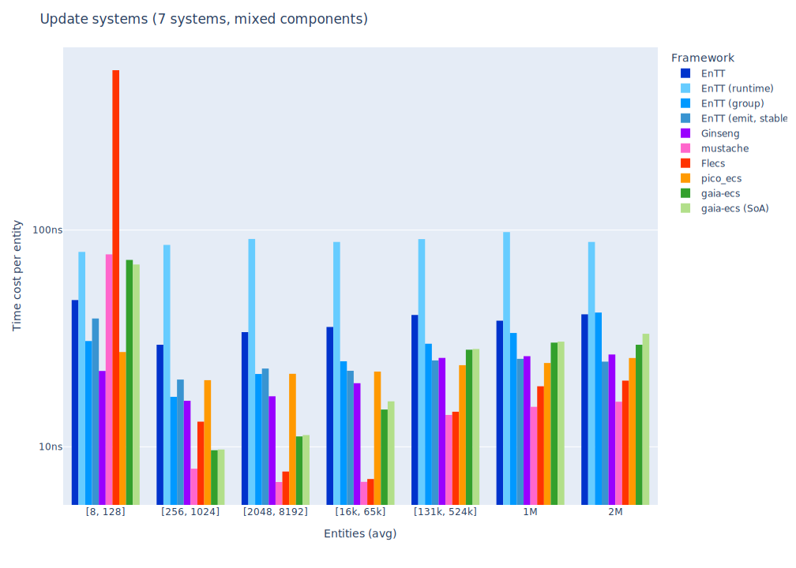

_Graph shows cost per entity, tables shows total cost. lower is faster._

|                                      | EnTT   | EnTT (runtime)   | EnTT (group)   | EnTT (emit, stable)   | Ginseng   | Flecs   | pico_ecs   | gaia-ecs   | gaia-ecs (SoA)   |
|:-------------------------------------|:-------|:-----------------|:---------------|:----------------------|:----------|:--------|:-----------|:-----------|:-----------------|
| Update     1 entities with 7 Systems | 75ns   | 80ns             | 70ns           | 84ns                  | 36ns      | 1405ns  | 46ns       | 200ns      | 187ns            |
| Update     4 entities with 7 Systems | 145ns  | 260ns            | 111ns          | 114ns                 | 76ns      | 2181ns  | 108ns      | 360ns      | 352ns            |
| Update     8 entities with 7 Systems | 243ns  | 454ns            | 160ns          | 166ns                 | 126ns     | 2270ns  | 172ns      | 422ns      | 392ns            |
| Update    16 entities with 7 Systems | 265ns  | 548ns            | 158ns          | 128ns                 | 162ns     | 2140ns  | 197ns      | 312ns      | 310ns            |
| Update    32 entities with 7 Systems | 442ns  | 1040ns           | 245ns          | 174ns                 | 292ns     | 2175ns  | 359ns      | 374ns      | 373ns            |
| Update    64 entities with 7 Systems | 781ns  | 1974ns           | 405ns          | 270ns                 | 551ns     | 2303ns  | 669ns      | 490ns      | 476ns            |

|                                      | EnTT   | EnTT (runtime)   | EnTT (group)   | EnTT (emit, stable)   | Ginseng   | Flecs   | pico_ecs   | gaia-ecs   | gaia-ecs (SoA)   |
|:-------------------------------------|:-------|:-----------------|:---------------|:----------------------|:----------|:--------|:-----------|:-----------|:-----------------|
| Update   256 entities with 7 Systems | 5us    | 14us             | 3us            | 3us                   | 3us       | 3us     | 4us        | 2us        | 1us              |
| Update   ~1K entities with 7 Systems | 26us   | 61us             | 16us           | 15us                  | 15us      | 8us     | 18us       | 8us        | 8us              |
| Update   ~4K entities with 7 Systems | 115us  | 252us            | 77us           | 73us                  | 64us      | 27us    | 73us       | 38us       | 38us             |
| Update  ~16K entities with 7 Systems | 484us  | 1048us           | 334us          | 315us                 | 250us     | 112us   | 296us      | 183us      | 189us            |

|                                      | EnTT   | EnTT (runtime)   | EnTT (group)   | EnTT (emit, stable)   | Ginseng   | Flecs   | pico_ecs   | gaia-ecs   | gaia-ecs (SoA)   |
|:-------------------------------------|:-------|:-----------------|:---------------|:----------------------|:----------|:--------|:-----------|:-----------|:-----------------|
| Update  ~65K entities with 7 Systems | 1ms    | 4ms              | 1ms            | 1ms                   | 0ms       | 0ms     | 1ms        | 0ms        | 0ms              |
| Update  262K entities with 7 Systems | 8ms    | 17ms             | 6ms            | 5ms                   | 5ms       | 2ms     | 8ms        | 6ms        | 5ms              |
| Update   ~1M entities with 7 Systems | 36ms   | 70ms             | 31ms           | 23ms                  | 24ms      | 16ms    | 42ms       | 26ms       | 26ms             |
| Update   ~2M entities with 7 Systems | 72ms   | 137ms            | 70ms           | 46ms                  | 45ms      | 32ms    | 84ms       | 53ms       | 53ms             |


While this benchmark only includes up to 6 components and 7 small systems,
it's important to note that Entity-Component-Systems can become much more complex in the wild,
with hundreds of components and systems.
Therefore, it's crucial to always benchmark your specific cases and systems when necessary and compare results.
Choose an ECS framework based on its features,
for example, EnTT offers [resource management](https://github.com/skypjack/entt/wiki/Crash-Course:-resource-management) and [event handling](https://github.com/skypjack/entt/wiki/Crash-Course:-events,-signals-and-everything-in-between),
while flecs provides useful [add-ons](https://github.com/SanderMertens/flecs#addons) and [querying](https://github.com/SanderMertens/flecs/tree/master/examples/cpp/queries/basics),
and EntityX includes a built-in [world/system manager](https://github.com/alecthomas/entityx#manager-tying-it-all-together=).

To evaluate a framework, look at the examples and API design, and pick the one that suits your needs.


## Details

### Features

All benchmarks are located in the [`benchmark/benchmarks/`](benchmark/benchmarks/) directory and write with with the [google/benchmark](https://github.com/google/benchmark) library.
Each benchmark uses an example application for each framework (see [`src/`](src) directory), and every example application has specific base features implemented (see [`src/base`](src/base)).

#### Components

1. `PositionComponent`: includes `x` and `y` coordinates.
2. `VelocityComponent`: includes `x` and `y` coordinates for movement.
3. `DataComponent`: includes some arbitrary data.
4. `HealthComponent`: Hero/Monster data includes HP/MaxHP and status.
5. `DamageComponent`: Hero/Monster data includes damage.
6. `SpriteComponent`: Hero/Monster ASCII character as sprite.

#### Systems

1. `MovementSystem`: updates the `PositionComponent` with a constant `VelocityComponent`.
2. `DataSystem`: updates the `DataComponent` with arbitrary data.
3. `MoreComplexSystem`: updates components with random data and arbitrary information.
4. `HealthSystem`: update Hero/Monster health (update HP and status).
5. `DamageSystem`: update Hero/Monster health by taking damage.
6. `SpriteSystem`: update Hero/Monster ASCII character depending on health and type.
7. `RenderSystem`: "render"(write) Hero/Monster character sprite into a "frame buffer"(string buffer).


## Additional Benchmarks

Benchmarks for more common features, such as "Creating entities", "Adding and removing components", and others.

### Features tested

* Entity Creation
* Entity Destruction
* Component Retrieval
* Adding and removing components
* Iterating entities/quires


### Environment

- **OS:** Linux
- **CPU:** 0.00GHz @ 0Cores
- **RAM:** 7.71GB


---

### Create entities


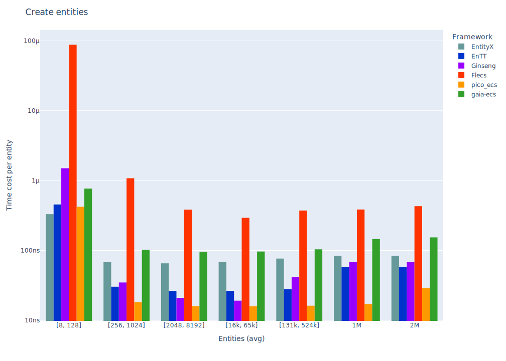

_Graph shows cost per entity, tables shows total cost. lower is faster._

|                                           | EntityX   | EnTT   | Ginseng   | Flecs    | pico_ecs   | gaia-ecs   |
|:------------------------------------------|:----------|:-------|:----------|:---------|:-----------|:-----------|
| Create     1 entities with two Components | 1080ns    | 1709ns | 5893ns    | 353208ns | 1649ns     | 2783ns     |
| Create     4 entities with two Components | 1378ns    | 1871ns | 6082ns    | 351360ns | 1693ns     | 3071ns     |
| Create     8 entities with two Components | 1676ns    | 2004ns | 6209ns    | 353144ns | 1737ns     | 3500ns     |
| Create    16 entities with two Components | 2239ns    | 2225ns | 6440ns    | 355245ns | 1880ns     | 4221ns     |
| Create    32 entities with two Components | 3315ns    | 2684ns | 6855ns    | 361172ns | 2117ns     | 5874ns     |
| Create    64 entities with two Components | 5430ns    | 3533ns | 7662ns    | 370441ns | 2583ns     | 9126ns     |

|                                           | EntityX   | EnTT   | Ginseng   | Flecs   | pico_ecs   | gaia-ecs   |
|:------------------------------------------|:----------|:-------|:----------|:--------|:-----------|:-----------|
| Create   256 entities with two Components | 18us      | 8us    | 11us      | 422us   | 5us        | 27us       |
| Create   ~1K entities with two Components | 67us      | 28us   | 26us      | 641us   | 16us       | 100us      |
| Create   ~4K entities with two Components | 266us     | 107us  | 84us      | 1515us  | 65us       | 388us      |
| Create  ~16K entities with two Components | 1091us    | 431us  | 311us     | 4980us  | 259us      | 1589us     |

|                                           | EntityX   | EnTT   | Ginseng   | Flecs   | pico_ecs   | gaia-ecs   |
|:------------------------------------------|:----------|:-------|:----------|:--------|:-----------|:-----------|
| Create  ~65K entities with two Components | 4ms       | 1ms    | 1ms       | 18ms    | 1ms        | 6ms        |
| Create  262K entities with two Components | 20ms      | 7ms    | 6ms       | 89ms    | 4ms        | 27ms       |
| Create   ~1M entities with two Components | 87ms      | 60ms   | 71ms      | 404ms   | 17ms       | 152ms      |
| Create   ~2M entities with two Components | 176ms     | 120ms  | 142ms     | 901ms   | 60ms       | 322ms      |


### Destroy entities


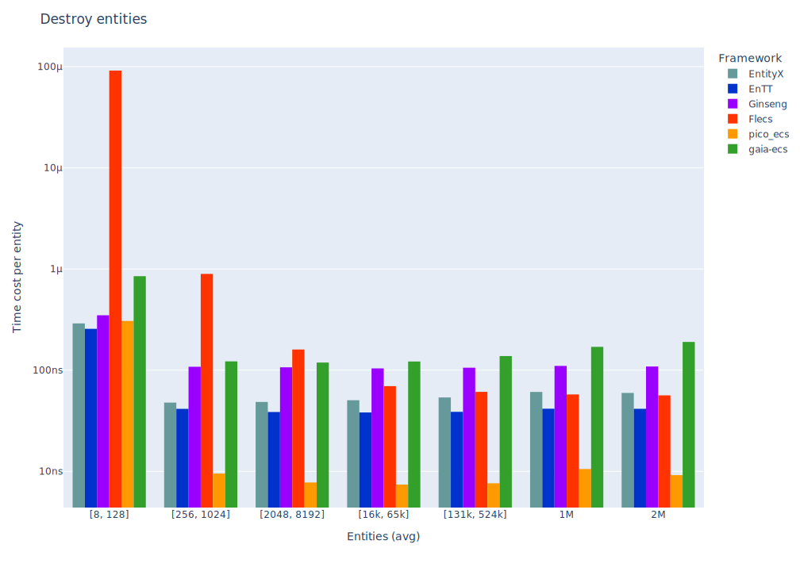

_Graph shows cost per entity, tables shows total cost. lower is faster._

|                                            | EntityX   | EnTT   | Ginseng   | Flecs    | pico_ecs   | gaia-ecs   |
|:-------------------------------------------|:----------|:-------|:----------|:---------|:-----------|:-----------|
| Destroy     1 entities with two components | 823ns     | 799ns  | 930ns     | 303005ns | 1629ns     | 1658ns     |
| Destroy     4 entities with two components | 970ns     | 844ns  | 1200ns    | 303266ns | 1657ns     | 1873ns     |
| Destroy     8 entities with two components | 1101ns    | 1033ns | 1536ns    | 303362ns | 1708ns     | 2190ns     |
| Destroy    16 entities with two components | 1379ns    | 1329ns | 2125ns    | 305039ns | 1754ns     | 2825ns     |
| Destroy    32 entities with two components | 1983ns    | 1903ns | 3286ns    | 305408ns | 1863ns     | 4194ns     |
| Destroy    64 entities with two components | 3160ns    | 2969ns | 5655ns    | 307853ns | 2112ns     | 6836ns     |

|                                            | EntityX   | EnTT   | Ginseng   | Flecs   | pico_ecs   | gaia-ecs   |
|:-------------------------------------------|:----------|:-------|:----------|:--------|:-----------|:-----------|
| Destroy   256 entities with two components | 10us      | 10us   | 19us      | 315us   | 3us        | 21us       |
| Destroy   ~1K entities with two components | 40us      | 35us   | 75us      | 357us   | 8us        | 83us       |
| Destroy   ~4K entities with two components | 166us     | 134us  | 295us     | 523us   | 28us       | 361us      |
| Destroy  ~16K entities with two components | 686us     | 565us  | 1170us    | 1174us  | 116us      | 1448us     |

|                                            | EntityX   | EnTT   | Ginseng   | Flecs   | pico_ecs   | gaia-ecs   |
|:-------------------------------------------|:----------|:-------|:----------|:--------|:-----------|:-----------|
| Destroy  ~65K entities with two components | 2ms       | 2ms    | 4ms       | 3ms     | 0ms        | 5ms        |
| Destroy  262K entities with two components | 11ms      | 9ms    | 21ms      | 17ms    | 1ms        | 25ms       |
| Destroy   ~1M entities with two components | 57ms      | 42ms   | 93ms      | 67ms    | 7ms        | 173ms      |
| Destroy   ~2M entities with two components | 116ms     | 85ms   | 186ms     | 134ms   | 15ms       | 411ms      |


### Get one component from entity


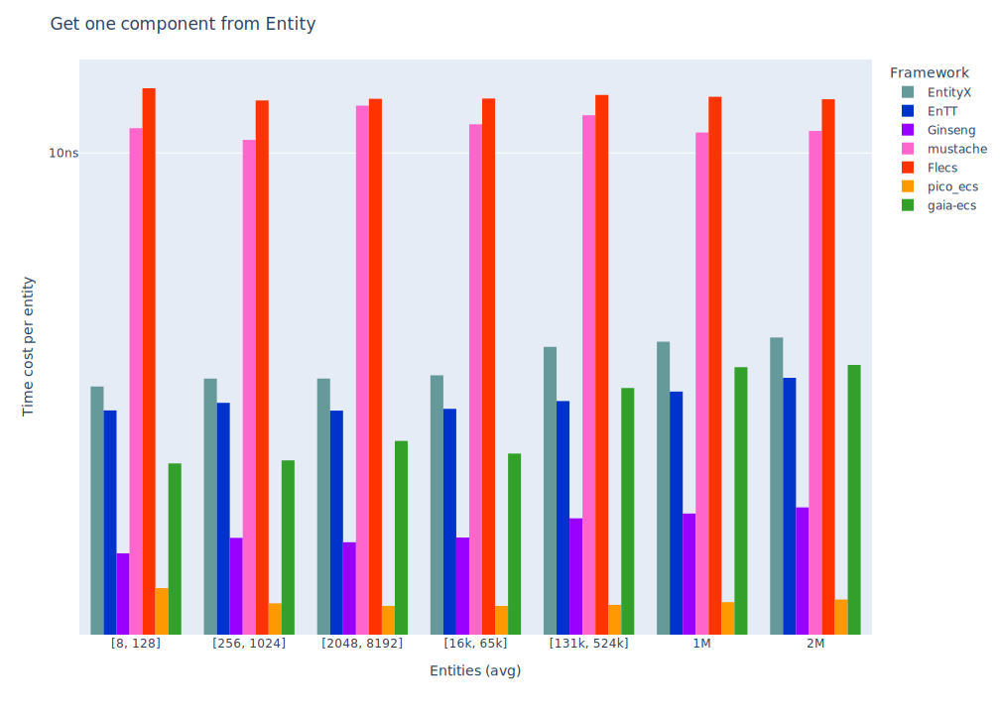

_Graph shows cost per entity, tables shows total cost. lower is faster._

|                                        | EntityX   | EnTT   | Ginseng   | Flecs   | pico_ecs   | gaia-ecs   |
|:---------------------------------------|:----------|:-------|:----------|:--------|:-----------|:-----------|
| Unpack one component in     1 entities | 3ns       | 3ns    | 1ns       | 12ns    | 1ns        | 2ns        |
| Unpack one component in     4 entities | 13ns      | 12ns   | 6ns       | 48ns    | 5ns        | 9ns        |
| Unpack one component in     8 entities | 27ns      | 23ns   | 12ns      | 101ns   | 12ns       | 18ns       |
| Unpack one component in    16 entities | 53ns      | 48ns   | 26ns      | 200ns   | 24ns       | 40ns       |
| Unpack one component in    32 entities | 107ns     | 95ns   | 52ns      | 387ns   | 53ns       | 76ns       |
| Unpack one component in    64 entities | 213ns     | 191ns  | 104ns     | 764ns   | 100ns      | 148ns      |

|                                        | EntityX   | EnTT   | Ginseng   | Flecs   | pico_ecs   | gaia-ecs   |
|:---------------------------------------|:----------|:-------|:----------|:--------|:-----------|:-----------|
| Unpack one component in   256 entities | 0us       | 0us    | 0us       | 3us     | 0us        | 0us        |
| Unpack one component in   ~1K entities | 3us       | 3us    | 1us       | 12us    | 1us        | 2us        |
| Unpack one component in   ~4K entities | 13us      | 12us   | 6us       | 48us    | 5us        | 9us        |
| Unpack one component in  ~16K entities | 54us      | 49us   | 26us      | 193us   | 23us       | 38us       |

|                                        | EntityX   | EnTT   | Ginseng   | Flecs   | pico_ecs   | gaia-ecs   |
|:---------------------------------------|:----------|:-------|:----------|:--------|:-----------|:-----------|
| Unpack one component in  ~65K entities | 0ms       | 0ms    | 0ms       | 0ms     | 0ms        | 0ms        |
| Unpack one component in  262K entities | 0ms       | 0ms    | 0ms       | 3ms     | 0ms        | 0ms        |
| Unpack one component in   ~1M entities | 4ms       | 3ms    | 2ms       | 12ms    | 1ms        | 3ms        |
| Unpack one component in   ~2M entities | 8ms       | 6ms    | 4ms       | 24ms    | 3ms        | 8ms        |


**Note:**
* Get one non-const component
   1. `PositionComponent`


### Get two components from entity


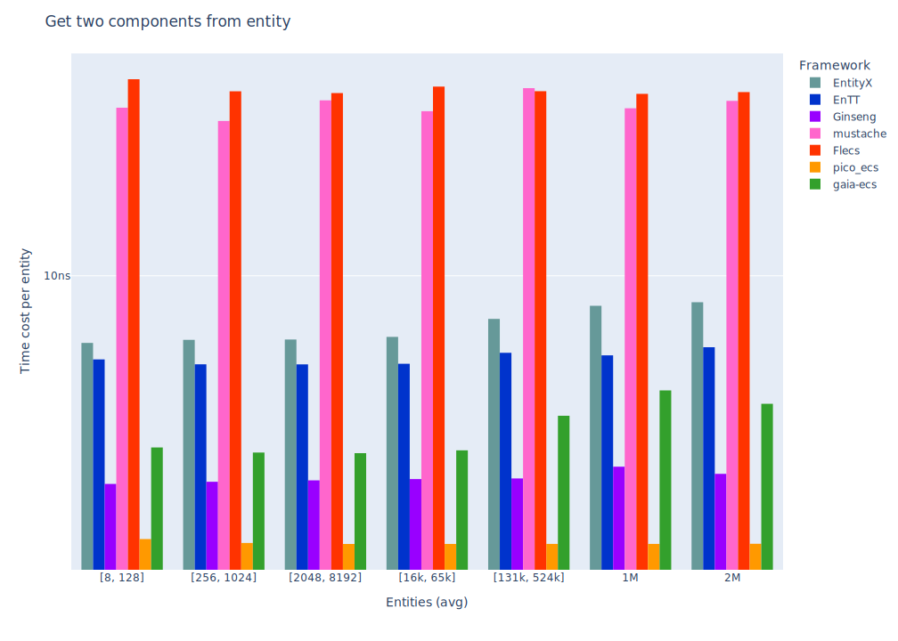

_Graph shows cost per entity, tables shows total cost. lower is faster._

|                                         | EntityX   | EnTT   | Ginseng   | Flecs   | pico_ecs   | gaia-ecs   |
|:----------------------------------------|:----------|:-------|:----------|:--------|:-----------|:-----------|
| Unpack two components in     1 entities | 6ns       | 6ns    | 3ns       | 23ns    | 2ns        | 4ns        |
| Unpack two components in     4 entities | 26ns      | 22ns   | 12ns      | 98ns    | 11ns       | 15ns       |
| Unpack two components in     8 entities | 53ns      | 45ns   | 25ns      | 189ns   | 24ns       | 34ns       |
| Unpack two components in    16 entities | 105ns     | 91ns   | 51ns      | 373ns   | 46ns       | 63ns       |
| Unpack two components in    32 entities | 212ns     | 183ns  | 100ns     | 733ns   | 98ns       | 121ns      |
| Unpack two components in    64 entities | 422ns     | 364ns  | 204ns     | 1467ns  | 189ns      | 238ns      |

|                                         | EntityX   | EnTT   | Ginseng   | Flecs   | pico_ecs   | gaia-ecs   |
|:----------------------------------------|:----------|:-------|:----------|:--------|:-----------|:-----------|
| Unpack two components in   256 entities | 1us       | 1us    | 0us       | 5us     | 0us        | 0us        |
| Unpack two components in   ~1K entities | 6us       | 5us    | 3us       | 23us    | 2us        | 3us        |
| Unpack two components in   ~4K entities | 27us      | 23us   | 12us      | 93us    | 11us       | 15us       |
| Unpack two components in  ~16K entities | 109us     | 93us   | 51us      | 373us   | 47us       | 61us       |

|                                         | EntityX   | EnTT   | Ginseng   | Flecs   | pico_ecs   | gaia-ecs   |
|:----------------------------------------|:----------|:-------|:----------|:--------|:-----------|:-----------|
| Unpack two components in  ~65K entities | 0ms       | 0ms    | 0ms       | 1ms     | 0ms        | 0ms        |
| Unpack two components in  262K entities | 1ms       | 1ms    | 0ms       | 5ms     | 0ms        | 1ms        |
| Unpack two components in   ~1M entities | 8ms       | 6ms    | 3ms       | 23ms    | 3ms        | 5ms        |
| Unpack two components in   ~2M entities | 16ms      | 12ms   | 7ms       | 47ms    | 6ms        | 10ms       |


**Note:**
* Get non-const- and const-component
   1. `PositionComponent`
   2. `const VelocityComponent`


### Get three components from entity


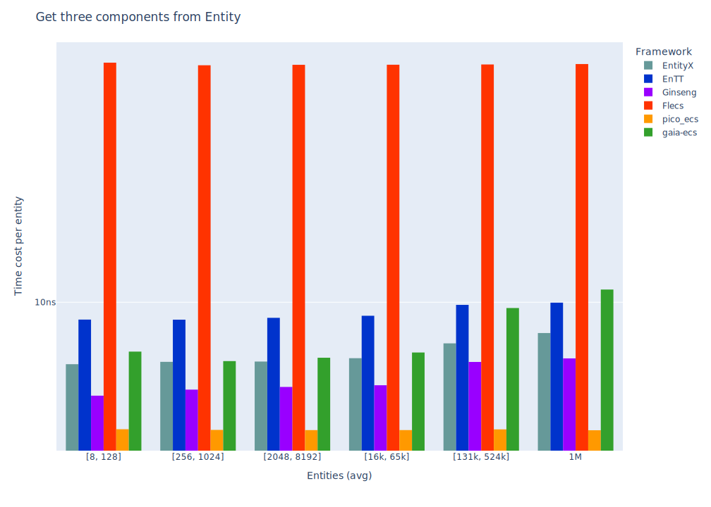

_Graph shows cost per entity, tables shows total cost. lower is faster._

|                                           | EntityX   | EnTT   | Ginseng   | Flecs   | pico_ecs   | gaia-ecs   |
|:------------------------------------------|:----------|:-------|:----------|:--------|:-----------|:-----------|
| Unpack three components in     1 entities | 7ns       | 9ns    | 5ns       | 48ns    | 4ns        | 8ns        |
| Unpack three components in     2 entities | 13ns      | 17ns   | 11ns      | 102ns   | 9ns        | 15ns       |
| Unpack three components in     8 entities | 54ns      | 72ns   | 44ns      | 383ns   | 35ns       | 56ns       |
| Unpack three components in    16 entities | 108ns     | 144ns  | 90ns      | 761ns   | 74ns       | 114ns      |
| Unpack three components in    32 entities | 216ns     | 288ns  | 177ns     | 1499ns  | 144ns      | 222ns      |
| Unpack three components in    64 entities | 429ns     | 571ns  | 358ns     | 3006ns  | 280ns      | 441ns      |
| Unpack three components in   128 entities | 873ns     | 1142ns | 718ns     | 6042ns  | 558ns      | 860ns      |

|                                           | EntityX   | EnTT   | Ginseng   | Flecs   | pico_ecs   | gaia-ecs   |
|:------------------------------------------|:----------|:-------|:----------|:--------|:-----------|:-----------|
| Unpack three components in   512 entities | 3us       | 4us    | 2us       | 24us    | 2us        | 3us        |
| Unpack three components in   ~2K entities | 13us      | 18us   | 11us      | 96us    | 8us        | 13us       |
| Unpack three components in   ~8K entities | 55us      | 73us   | 47us      | 387us   | 35us       | 59us       |

|                                           | EntityX   | EnTT   | Ginseng   | Flecs   | pico_ecs   | gaia-ecs   |
|:------------------------------------------|:----------|:-------|:----------|:--------|:-----------|:-----------|
| Unpack three components in  ~32K entities | 0ms       | 0ms    | 0ms       | 1ms     | 0ms        | 0ms        |
| Unpack three components in  131K entities | 0ms       | 1ms    | 0ms       | 6ms     | 0ms        | 1ms        |
| Unpack three components in  524K entities | 4ms       | 5ms    | 3ms       | 24ms    | 2ms        | 5ms        |
| Unpack three components in   ~1M entities | 8ms       | 10ms   | 7ms       | 49ms    | 4ms        | 11ms       |


**Note:**
* Not every entity has three components, some has only two
* Get two non-const- and const-component(s)
   1. `PositionComponent`
   2. `const VelocityComponent`
   3. `DataComponent` (optional)


### Remove and add component


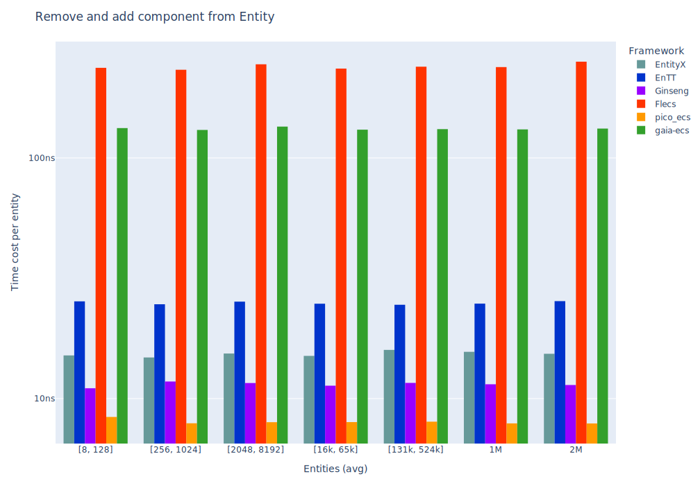

_Graph shows cost per entity, tables shows total cost. lower is faster._

|                                              | EntityX   | EnTT   | Ginseng   | Flecs   | pico_ecs   | gaia-ecs   |
|:---------------------------------------------|:----------|:-------|:----------|:--------|:-----------|:-----------|
| Remove and Add a Component in     1 entities | 17ns      | 20ns   | 9ns       | 214ns   | 9ns        | 101ns      |
| Remove and Add a Component in     4 entities | 67ns      | 79ns   | 39ns      | 827ns   | 39ns       | 461ns      |
| Remove and Add a Component in     8 entities | 132ns     | 158ns  | 78ns      | 1647ns  | 84ns       | 921ns      |
| Remove and Add a Component in    16 entities | 262ns     | 322ns  | 162ns     | 3263ns  | 162ns      | 1826ns     |
| Remove and Add a Component in    32 entities | 532ns     | 636ns  | 319ns     | 6540ns  | 319ns      | 3657ns     |
| Remove and Add a Component in    64 entities | 1044ns    | 1272ns | 631ns     | 12941ns | 629ns      | 7268ns     |

|                                              | EntityX   | EnTT   | Ginseng   | Flecs   | pico_ecs   | gaia-ecs   |
|:---------------------------------------------|:----------|:-------|:----------|:--------|:-----------|:-----------|
| Remove and Add a Component in   256 entities | 4us       | 4us    | 2us       | 51us    | 2us        | 29us       |
| Remove and Add a Component in   ~1K entities | 16us      | 20us   | 10us      | 208us   | 10us       | 117us      |
| Remove and Add a Component in   ~4K entities | 66us      | 81us   | 40us      | 831us   | 39us       | 469us      |
| Remove and Add a Component in  ~16K entities | 265us     | 328us  | 165us     | 3355us  | 159us      | 1900us     |

|                                              | EntityX   | EnTT   | Ginseng   | Flecs   | pico_ecs   | gaia-ecs   |
|:---------------------------------------------|:----------|:-------|:----------|:--------|:-----------|:-----------|
| Remove and Add a Component in  ~65K entities | 1ms       | 1ms    | 0ms       | 13ms    | 0ms        | 7ms        |
| Remove and Add a Component in  262K entities | 4ms       | 5ms    | 2ms       | 53ms    | 2ms        | 30ms       |
| Remove and Add a Component in   ~1M entities | 17ms      | 21ms   | 10ms      | 213ms   | 10ms       | 121ms      |
| Remove and Add a Component in   ~2M entities | 34ms      | 42ms   | 21ms      | 426ms   | 21ms       | 241ms      |


**Note:**
* Remove and add `PositionComponent`


### Update systems (for-each entities in 2 systems)


  Cost per entity                         |  Cost of all entities
:-------------------------------------------:|:------------------------------------------------------:
  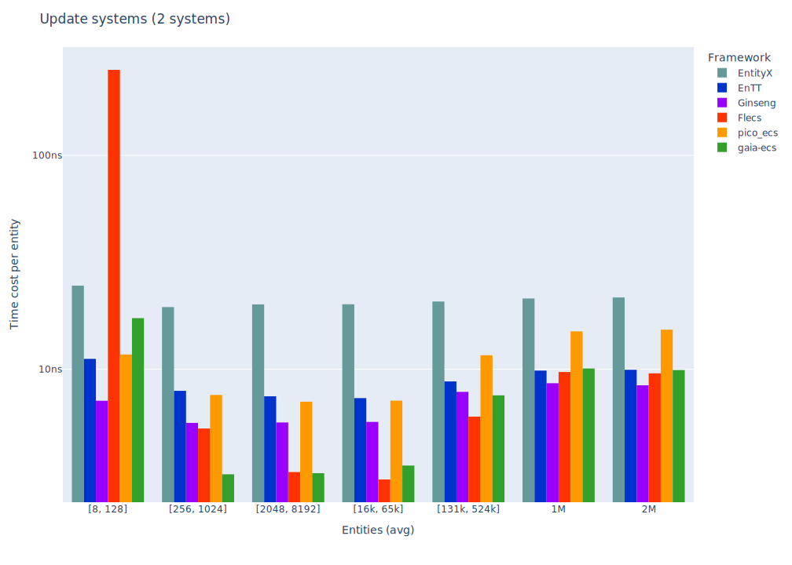  |  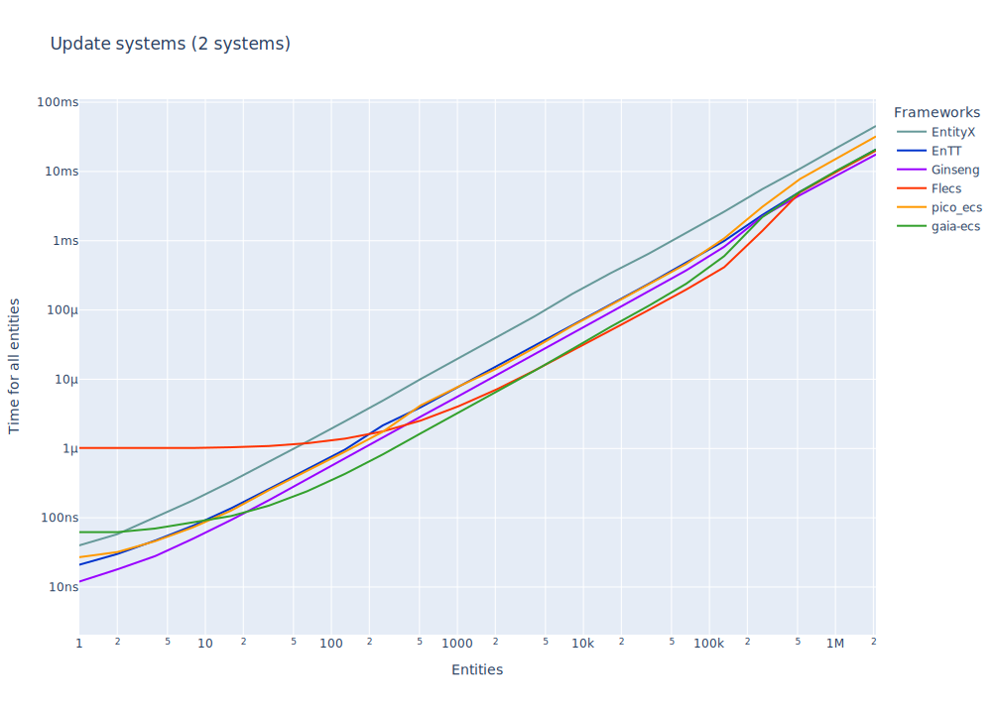  


_Tables shows total cost. lower is faster._

|                                      | EntityX   | EnTT   | Ginseng   | Flecs   | pico_ecs   | gaia-ecs   |
|:-------------------------------------|:----------|:-------|:----------|:--------|:-----------|:-----------|
| Update     1 entities with 2 systems | 40ns      | 21ns   | 12ns      | 998ns   | 27ns       | 61ns       |
| Update     4 entities with 2 systems | 103ns     | 47ns   | 28ns      | 1016ns  | 46ns       | 70ns       |
| Update     8 entities with 2 systems | 179ns     | 77ns   | 50ns      | 1018ns  | 73ns       | 86ns       |
| Update    16 entities with 2 systems | 334ns     | 137ns  | 93ns      | 1042ns  | 127ns      | 106ns      |
| Update    32 entities with 2 systems | 640ns     | 261ns  | 180ns     | 1087ns  | 251ns      | 150ns      |
| Update    64 entities with 2 systems | 1254ns    | 500ns  | 362ns     | 1191ns  | 469ns      | 241ns      |

|                                      | EntityX   | EnTT   | Ginseng   | Flecs   | pico_ecs   | gaia-ecs   |
|:-------------------------------------|:----------|:-------|:----------|:--------|:-----------|:-----------|
| Update   256 entities with 2 systems | 4us       | 2us    | 1us       | 1us     | 1us        | 0us        |
| Update   ~1K entities with 2 systems | 20us      | 7us    | 5us       | 4us     | 7us        | 3us        |
| Update   ~4K entities with 2 systems | 81us      | 30us   | 22us      | 13us    | 28us       | 13us       |
| Update  ~16K entities with 2 systems | 339us     | 119us  | 92us      | 50us    | 117us      | 56us       |

|                                      | EntityX   | EnTT   | Ginseng   | Flecs   | pico_ecs   | gaia-ecs   |
|:-------------------------------------|:----------|:-------|:----------|:--------|:-----------|:-----------|
| Update  ~65K entities with 2 systems | 1ms       | 0ms    | 0ms       | 0ms     | 0ms        | 0ms        |
| Update  262K entities with 2 systems | 5ms       | 2ms    | 2ms       | 1ms     | 3ms        | 2ms        |
| Update   ~1M entities with 2 systems | 22ms      | 10ms   | 9ms       | 10ms    | 15ms       | 10ms       |
| Update   ~2M entities with 2 systems | 45ms      | 20ms   | 17ms      | 20ms    | 32ms       | 20ms       |


**Note:**
* Systems used
    1. `MovementSystem`
    2. `DataSystem`


### Update systems (for-each entities (with mixed components) in 2 systems)


  Cost per entity                         |  Cost of all entities
:-------------------------------------------:|:------------------------------------------------------:
  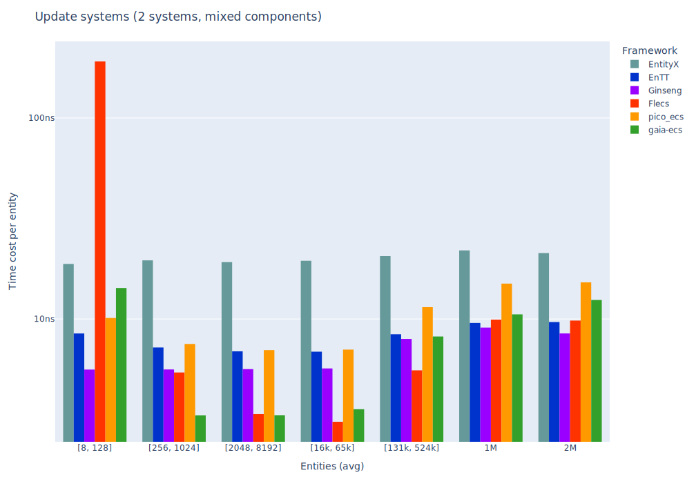  |  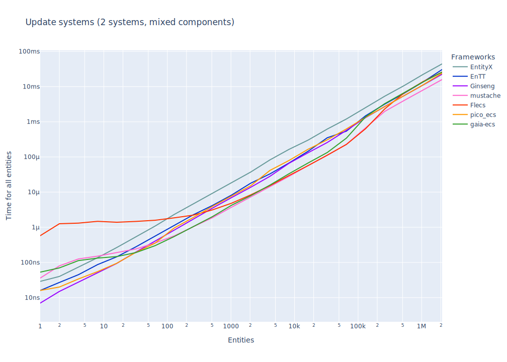  


_Tables shows total cost. lower is faster._

|                                      | EntityX   | EnTT   | Ginseng   | Flecs   | pico_ecs   | gaia-ecs   |
|:-------------------------------------|:----------|:-------|:----------|:--------|:-----------|:-----------|
| Update     1 entities with 2 systems | 23ns      | 11ns   | 7ns       | 493ns   | 23ns       | 34ns       |
| Update     4 entities with 2 systems | 78ns      | 37ns   | 24ns      | 1048ns  | 39ns       | 79ns       |
| Update     8 entities with 2 systems | 147ns     | 65ns   | 44ns      | 1083ns  | 65ns       | 107ns      |
| Update    16 entities with 2 systems | 269ns     | 116ns  | 80ns      | 1099ns  | 112ns      | 118ns      |
| Update    32 entities with 2 systems | 530ns     | 228ns  | 158ns     | 1161ns  | 206ns      | 165ns      |
| Update    64 entities with 2 systems | 1044ns    | 437ns  | 308ns     | 1237ns  | 399ns      | 258ns      |

|                                      | EntityX   | EnTT   | Ginseng   | Flecs   | pico_ecs   | gaia-ecs   |
|:-------------------------------------|:----------|:-------|:----------|:--------|:-----------|:-----------|
| Update   256 entities with 2 systems | 5us       | 1us    | 1us       | 1us     | 1us        | 0us        |
| Update   ~1K entities with 2 systems | 19us      | 7us    | 5us       | 4us     | 7us        | 3us        |
| Update   ~4K entities with 2 systems | 77us      | 28us   | 23us      | 13us    | 28us       | 13us       |
| Update  ~16K entities with 2 systems | 316us     | 111us  | 92us      | 51us    | 115us      | 57us       |

|                                      | EntityX   | EnTT   | Ginseng   | Flecs   | pico_ecs   | gaia-ecs   |
|:-------------------------------------|:----------|:-------|:----------|:--------|:-----------|:-----------|
| Update  ~65K entities with 2 systems | 1ms       | 0ms    | 0ms       | 0ms     | 0ms        | 0ms        |
| Update  262K entities with 2 systems | 5ms       | 2ms    | 2ms       | 1ms     | 3ms        | 2ms        |
| Update   ~1M entities with 2 systems | 23ms      | 10ms   | 9ms       | 10ms    | 15ms       | 11ms       |
| Update   ~2M entities with 2 systems | 44ms      | 20ms   | 17ms      | 20ms    | 31ms       | 26ms       |


**Note:**
* Systems used
    1. `MovementSystem`
    2. `DataSystem`
* Not every entity has all three components, some got removed


### Update systems (for-each entities in 7 systems)


  Cost per entity                         |  Cost of all entities
:-------------------------------------------:|:------------------------------------------------------:
  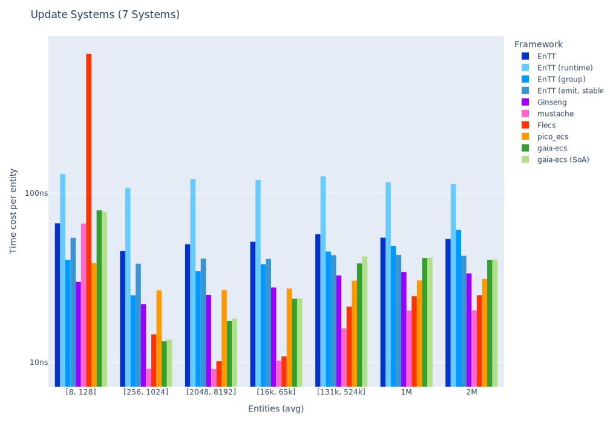  |  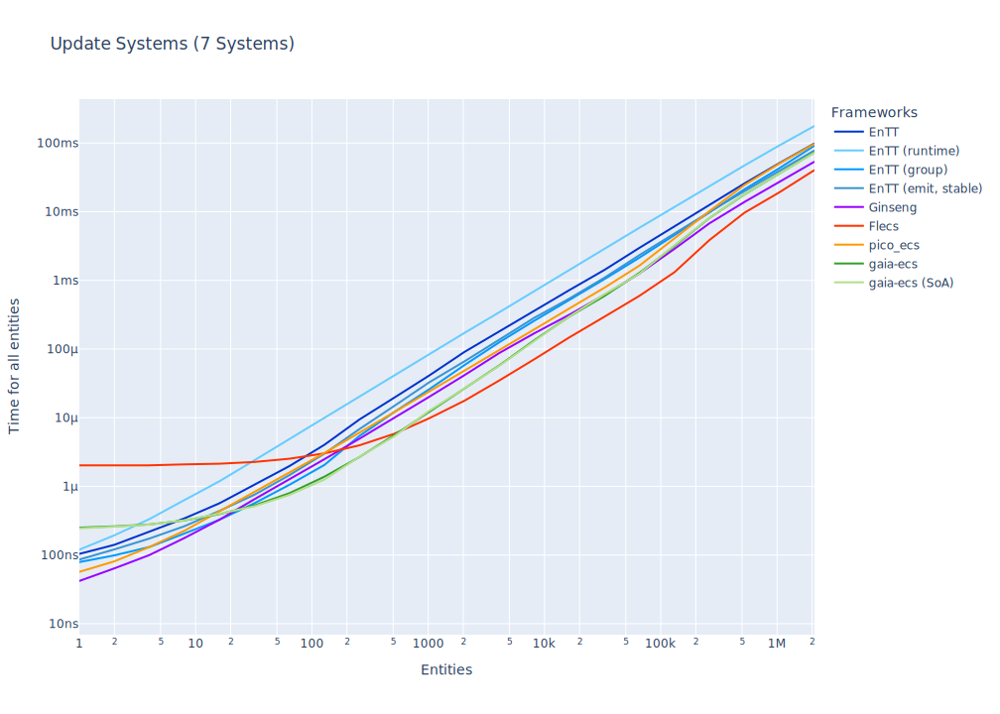  


_Tables shows total cost. lower is faster._

|                                      | EnTT   | EnTT (runtime)   | EnTT (group)   | EnTT (emit, stable)   | Ginseng   | Flecs   | pico_ecs   | gaia-ecs   | gaia-ecs (SoA)   |
|:-------------------------------------|:-------|:-----------------|:---------------|:----------------------|:----------|:--------|:-----------|:-----------|:-----------------|
| Update     1 entities with 7 systems | 104ns  | 120ns            | 79ns           | 86ns                  | 42ns      | 2024ns  | 57ns       | 251ns      | 245ns            |
| Update     4 entities with 7 systems | 218ns  | 334ns            | 131ns          | 174ns                 | 100ns     | 2025ns  | 131ns      | 279ns      | 278ns            |
| Update     8 entities with 7 systems | 342ns  | 632ns            | 206ns          | 263ns                 | 177ns     | 2091ns  | 226ns      | 319ns      | 321ns            |
| Update    16 entities with 7 systems | 567ns  | 1187ns           | 326ns          | 439ns                 | 327ns     | 2139ns  | 432ns      | 394ns      | 400ns            |
| Update    32 entities with 7 systems | 1062ns | 2400ns           | 568ns          | 756ns                 | 650ns     | 2267ns  | 840ns      | 528ns      | 512ns            |
| Update    64 entities with 7 systems | 1976ns | 4904ns           | 1055ns         | 1458ns                | 1254ns    | 2527ns  | 1588ns     | 796ns      | 751ns            |

|                                      | EnTT   | EnTT (runtime)   | EnTT (group)   | EnTT (emit, stable)   | Ginseng   | Flecs   | pico_ecs   | gaia-ecs   | gaia-ecs (SoA)   |
|:-------------------------------------|:-------|:-----------------|:---------------|:----------------------|:----------|:--------|:-----------|:-----------|:-----------------|
| Update   256 entities with 7 systems | 9us    | 20us             | 5us            | 6us                   | 4us       | 3us     | 6us        | 2us        | 2us              |
| Update   ~1K entities with 7 systems | 41us   | 83us             | 26us           | 32us                  | 20us      | 9us     | 23us       | 12us       | 12us             |
| Update   ~4K entities with 7 systems | 178us  | 344us            | 125us          | 136us                 | 87us      | 34us    | 96us       | 58us       | 57us             |
| Update  ~16K entities with 7 systems | 723us  | 1438us           | 515us          | 543us                 | 316us     | 148us   | 390us      | 297us      | 298us            |

|                                      | EnTT   | EnTT (runtime)   | EnTT (group)   | EnTT (emit, stable)   | Ginseng   | Flecs   | pico_ecs   | gaia-ecs   | gaia-ecs (SoA)   |
|:-------------------------------------|:-------|:-----------------|:---------------|:----------------------|:----------|:--------|:-----------|:-----------|:-----------------|
| Update  ~65K entities with 7 systems | 2ms    | 5ms              | 2ms            | 2ms                   | 1ms       | 0ms     | 1ms        | 1ms        | 1ms              |
| Update  262K entities with 7 systems | 12ms   | 23ms             | 9ms            | 9ms                   | 6ms       | 3ms     | 10ms       | 8ms        | 8ms              |
| Update   ~1M entities with 7 systems | 51ms   | 92ms             | 43ms           | 39ms                  | 27ms      | 19ms    | 50ms       | 36ms       | 36ms             |
| Update   ~2M entities with 7 systems | 98ms   | 177ms            | 91ms           | 78ms                  | 53ms      | 40ms    | 97ms       | 73ms       | 72ms             |


**Note:**
* Systems used
    1. `MovementSystem`
    2. `DataSystem`
    3. `MoreComplexSystem`
    4. `HealthSystem`
    5. `DamageSystem`
    6. `SpriteSystem`
    7. `RenderSystem`
* \*   EnTT iterate components via [views](https://github.com/skypjack/entt/wiki/Crash-Course:-entity-component-system#views=)
* \**  EnTT iterate components via [runtime views](https://github.com/skypjack/entt/wiki/Crash-Course:-entity-component-system#runtime-views=)
* \*** EnTT iterate components via [groups](https://github.com/skypjack/entt/wiki/Crash-Course:-entity-component-system#groups=):
   1. `DataSystem`: No Group, use `registry.view<DataComponent>`. _(Can't group a single component)_
   2. `MovementSystem`: Partial-owning group, `registry.group<PositionComponent>(entt::get<const VelocityComponent>)`
   3. `MoreComplexSystem`: Full-owning group, `registry.group<PositionComponent, VelocityComponent, DataComponent>()`
* \**** EnTT iterate components via view and uses a [stable component](https://github.com/skypjack/entt/wiki/Crash-Course:-entity-component-system#pointer-stability=) (`StablePositionComponent`)
* \***** gaia-ecs (SoA) iterate via [SoA Layout](https://github.com/richardbiely/gaia-ecs?tab=readme-ov-file#data-layouts) using an `Position`- and `Velocity`-SoA-component


### Update systems (for-each entities (with mixed components) in 7 systems)


  Cost per entity                         |  Cost of all entities
:-------------------------------------------:|:------------------------------------------------------:
    |  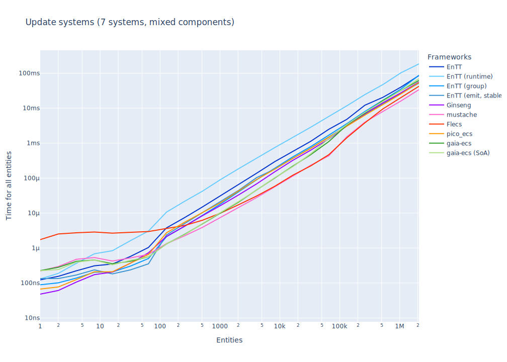  


_Tables shows total cost. lower is faster._

|                                      | EnTT   | EnTT (runtime)   | EnTT (group)   | EnTT (emit, stable)   | Ginseng   | Flecs   | pico_ecs   | gaia-ecs   | gaia-ecs (SoA)   |
|:-------------------------------------|:-------|:-----------------|:---------------|:----------------------|:----------|:--------|:-----------|:-----------|:-----------------|
| Update     1 entities with 7 Systems | 75ns   | 80ns             | 70ns           | 84ns                  | 36ns      | 1405ns  | 46ns       | 200ns      | 187ns            |
| Update     4 entities with 7 Systems | 145ns  | 260ns            | 111ns          | 114ns                 | 76ns      | 2181ns  | 108ns      | 360ns      | 352ns            |
| Update     8 entities with 7 Systems | 243ns  | 454ns            | 160ns          | 166ns                 | 126ns     | 2270ns  | 172ns      | 422ns      | 392ns            |
| Update    16 entities with 7 Systems | 265ns  | 548ns            | 158ns          | 128ns                 | 162ns     | 2140ns  | 197ns      | 312ns      | 310ns            |
| Update    32 entities with 7 Systems | 442ns  | 1040ns           | 245ns          | 174ns                 | 292ns     | 2175ns  | 359ns      | 374ns      | 373ns            |
| Update    64 entities with 7 Systems | 781ns  | 1974ns           | 405ns          | 270ns                 | 551ns     | 2303ns  | 669ns      | 490ns      | 476ns            |

|                                      | EnTT   | EnTT (runtime)   | EnTT (group)   | EnTT (emit, stable)   | Ginseng   | Flecs   | pico_ecs   | gaia-ecs   | gaia-ecs (SoA)   |
|:-------------------------------------|:-------|:-----------------|:---------------|:----------------------|:----------|:--------|:-----------|:-----------|:-----------------|
| Update   256 entities with 7 Systems | 5us    | 14us             | 3us            | 3us                   | 3us       | 3us     | 4us        | 2us        | 1us              |
| Update   ~1K entities with 7 Systems | 26us   | 61us             | 16us           | 15us                  | 15us      | 8us     | 18us       | 8us        | 8us              |
| Update   ~4K entities with 7 Systems | 115us  | 252us            | 77us           | 73us                  | 64us      | 27us    | 73us       | 38us       | 38us             |
| Update  ~16K entities with 7 Systems | 484us  | 1048us           | 334us          | 315us                 | 250us     | 112us   | 296us      | 183us      | 189us            |

|                                      | EnTT   | EnTT (runtime)   | EnTT (group)   | EnTT (emit, stable)   | Ginseng   | Flecs   | pico_ecs   | gaia-ecs   | gaia-ecs (SoA)   |
|:-------------------------------------|:-------|:-----------------|:---------------|:----------------------|:----------|:--------|:-----------|:-----------|:-----------------|
| Update  ~65K entities with 7 Systems | 1ms    | 4ms              | 1ms            | 1ms                   | 0ms       | 0ms     | 1ms        | 0ms        | 0ms              |
| Update  262K entities with 7 Systems | 8ms    | 17ms             | 6ms            | 5ms                   | 5ms       | 2ms     | 8ms        | 6ms        | 5ms              |
| Update   ~1M entities with 7 Systems | 36ms   | 70ms             | 31ms           | 23ms                  | 24ms      | 16ms    | 42ms       | 26ms       | 26ms             |
| Update   ~2M entities with 7 Systems | 72ms   | 137ms            | 70ms           | 46ms                  | 45ms      | 32ms    | 84ms       | 53ms       | 53ms             |


**Note:**
* Systems used
    1. `MovementSystem`
    2. `DataSystem`
    3. `MoreComplexSystem`
    4. `HealthSystem`
    5. `DamageSystem`
    6. `SpriteSystem`
    7. `RenderSystem`
* Not every entity has all three components, some got removed
* \*   EnTT iterate components via [views](https://github.com/skypjack/entt/wiki/Crash-Course:-entity-component-system#views=)
* \**  EnTT iterate components via [runtime views](https://github.com/skypjack/entt/wiki/Crash-Course:-entity-component-system#runtime-views=)
* \*** EnTT iterate components via [groups](https://github.com/skypjack/entt/wiki/Crash-Course:-entity-component-system#groups=):
    1. `DataSystem`: No Group, use `registry.view<DataComponent>`. _(Can't group a single component)_
    2. `MovementSystem`: Partial-owning group, `registry.group<PositionComponent>(entt::get<const VelocityComponent>)`
    3. `MoreComplexSystem`: Full-owning group, `registry.group<PositionComponent, VelocityComponent, DataComponent>()`
* \**** EnTT iterate components via view and uses a [stable component](https://github.com/skypjack/entt/wiki/Crash-Course:-entity-component-system#pointer-stability=) (`StablePositionComponent`)
* \***** gaia-ecs (SoA) iterate via [SoA Layout](https://github.com/richardbiely/gaia-ecs?tab=readme-ov-file#data-layouts) using an `Position`- und `Velocity`-SoA-component


## Contributing

If you have any improvements to the ECS-examples for any of the frameworks,
feel free to make a pull request or open an issue.
The example(s) for each framework can be found in [`src/`](src/), and benchmarks are located in [`benchmarks/benchmarks/`](benchmarks/benchmarks/) for more details.

Additionally, you can write tests for the framework example and add some metadata to the [plot.config.json](plot.config.json) file.
Any contributions are greatly appreciated!

_TODO: make more detailed "how to add framework"_

Read [CONTRIBUTING.md](CONTRIBUTING) for more details.

## Run Benchmarks

### Using [Taskfile](https://taskfile.dev/installation/)

0. Install [Taskfile](https://taskfile.dev/installation/)
1. Run Build: `task build`
2. Run (All) Benchmarks: `task benchmark`
3. Plot Graphs: `task plot:all`

Or run `task generate`

You can now find the benchmark-results in [`reports/`](reports/).

_You need python (>=3.8.0) and some [dependencies](scripts/gen-benchmark-report/requirements.txt) to run [gen-benchmark-report](scripts/gen-benchmark-report) (plotting), install [pipx](https://pipx.pypa.io/stable/installation/) and [poetry](https://python-poetry.org/docs/#installing-with-pipx)._

Then install the dependencies for the script:
```bash
cd ./scripts/gen-benchmark-report && poetry install
```

Or run the script directly:
```bash
task plot:all
```

#### Generate README

```bash
task generate:readme
```


### ~~Step-by-Step~~

1. Configure and build benchmarks, see [Building Details](doc/README_building.md):
   1. `cmake -S . -B ./build`
   2. `cmake --build ./build`
2. Run benchmark(s), with [`run-benchmarks.sh`](run-benchmarks.sh) or each:
   * `./build/benchmark/benchmarks/entt/ecs-benchmark-entt` _(console output)_ _(optional)_
   * `./build/benchmark/benchmarks/entt/ecs-benchmark-entt --benchmark_format=json > ./reports/entt.json` _(write json report)_
3. Plot Reports, after generating json reports, see [`plot-results.sh`](plot-results.sh):
   1. `pipx run --spec ./scripts/gen-benchmark-report gen-benchmark-report -i ./info.json gen-plot ./reports/entityx.json ./reports/entt.json ./reports/ginseng.json ./reports/mustache.json ./reports/openecs.json ./reports/flecs.json` _(generate graphs)_
   2. `pipx run --spec ./scripts/gen-benchmark-report gen-benchmark-report -i ./info.json gen-results-md ./reports/entityx.json ./reports/entt.json ./reports/ginseng.json ./reports/mustache.json ./reports/openecs.json ./reports/flecs.json` _(generate full report)_


### Run a single benchmark

```bash
cmake -G Ninja -S . -B build
cmake --build build --target ecs-benchmark-entt -j 4
./build/benchmark/benchmarks/entt/ecs-benchmark-entt
```

You can use `-DCMAKE_BUILD_TYPE=Debug` to enable Sanitizers.


## Links and More

- [Dependency Setup](doc/README_dependencies.md)
- [Building Details](doc/README_building.md)
- Project Template, mix of: [starter_template](https://github.com/cpp-best-practices/gui_starter_template) and [ModernCppStarter](https://github.com/TheLartians/ModernCppStarter)
  - [Forked cpp_vcpkg_project](https://github.com/abeimler/cpp_vcpkg_project)
- [Google benchmark](https://github.com/google/benchmark)
- https://github.com/SanderMertens/ecs-faq
- https://github.com/jslee02/awesome-entity-component-system


### Candidates

#### EntityX by @alecthomas 

> Entity Component Systems (ECS) are a form of decomposition that completely decouples entity logic and data from the entity "objects" themselves. The Evolve your Hierarchy article provides a solid overview of EC systems and why you should use them.

Version: 1.1.2 (Apr 2023)

#### EnTT by @skypjack 

> EnTT is a header-only, tiny and easy to use library for game programming and much more written in modern C++.

Version: v3.13.2

#### Ginseng by @apples 

> Ginseng is an entity-component-system (ECS) library designed for use in games.

The main advantage over similar libraries is that the component types do not need to be listed or registered. Component types are detected dynamically.

Any function-like object can be used as a system. The function's parameters are used to determine the required components.

Version: 1.1 (Dec 2021)

#### mustache by @kirillochnev 

> A fast, modern C++ Entity Component System

Version: 0.2 (Feb 2024)

#### OpenEcs by @Gronis 

> Open Ecs is an Entity Component System that uses metaprogramming, cache coherency, and other useful tricks to maximize performance and configurability. It is written in c++11 without further dependencies.

Version: 0.1.101 (Apr 2017)

#### Flecs by @SanderMertens 

> Flecs is a fast and lightweight Entity Component System that lets you build games and simulations with millions of entities.

Version: v4.0.1

#### pico_ecs by @empyreanx 

> A collection of cross-platform single header libraries written in C. Pure and simple ECS.

Version: 2.3 (Sep 2023)

#### gaia-ecs by @richardbiely 

> Gaia-ECS is a fast and easy-to-use ECS framework.

Version: v0.8.6

